# python-api-challenge  
Demonstrates ability to link into both Google and weather APIs

## WeatherPy Correlation Analysis
Correlations within this dataset analyze northern and southern hemispheres separately.  
As shown below, the only correlation found was between latitude and maximum temperature:  

Strong Correlation show below:  
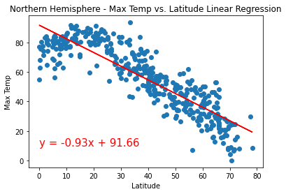  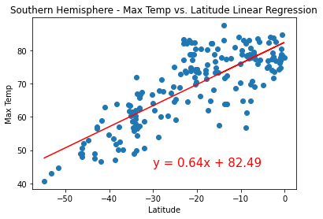

Weak Correlation show for the rest below:  
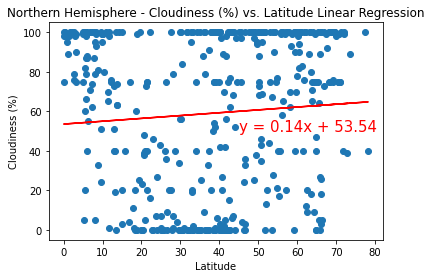  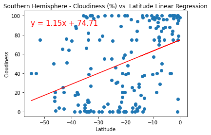

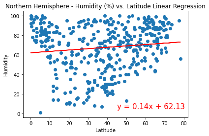  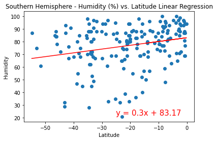

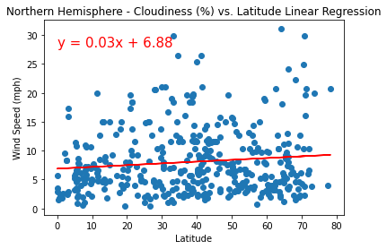  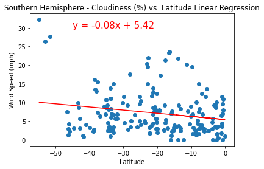

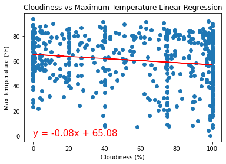 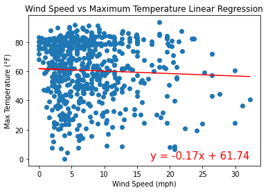  

## VacationPy Analysis
Most of the towns picked which meet the chosen criteria fall near coastlines.  This is largely because of the initial seeding algorithm.  When points are scattered evenly on a Mercator projection, roughly 3/4 of the points should fall on bodies of water.  The nearest city from that will very often be something on a coast.  This phenomenon is exaggerated in the southern hemisphere for the same reason: less land below the equator.  It should therefore be of little surprise that many of the chosen points will lie in the southern hemisphere.  

After selecting weather criteria (Max Temp between 70 and 80°F, Wind Speed < 10 mph, and cloudless skies), I found it rather interesting that 3 of the 14 locations lie on the tiny island of Mauritius, near Madagascar.  I suppose that means after landing a data analyst job, I may need to explore traveling to that country!  
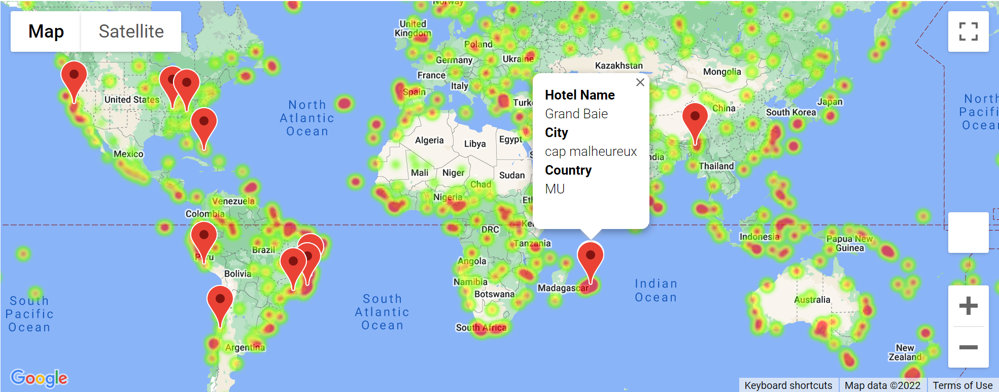